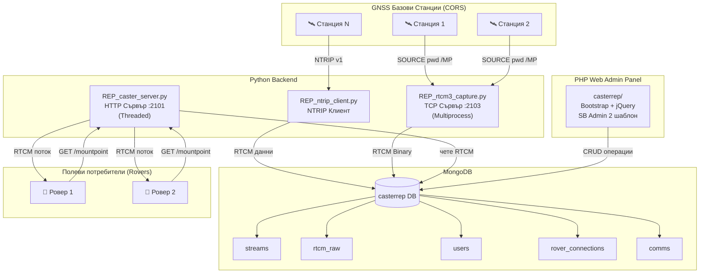
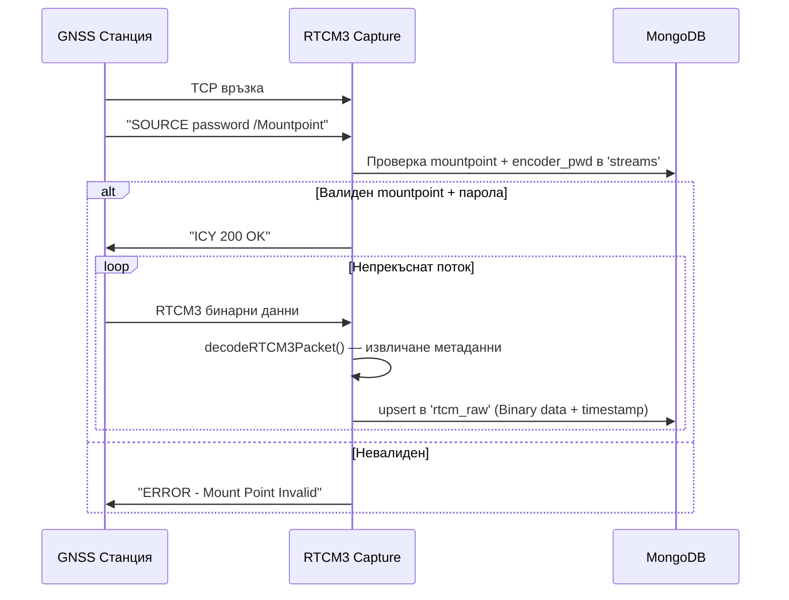
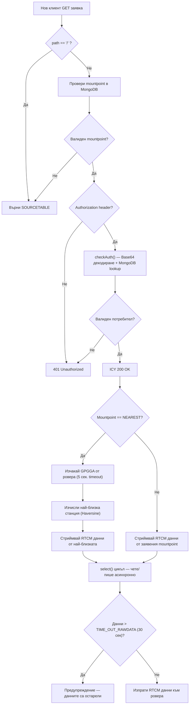
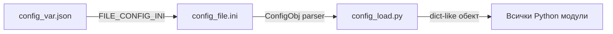
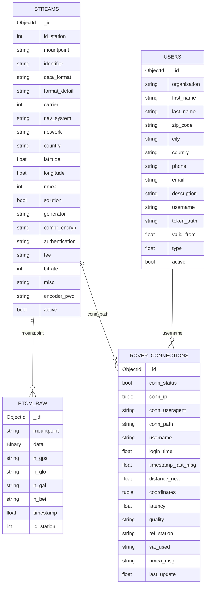
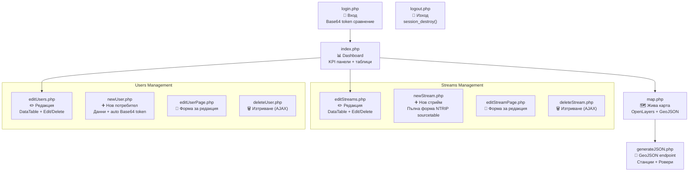
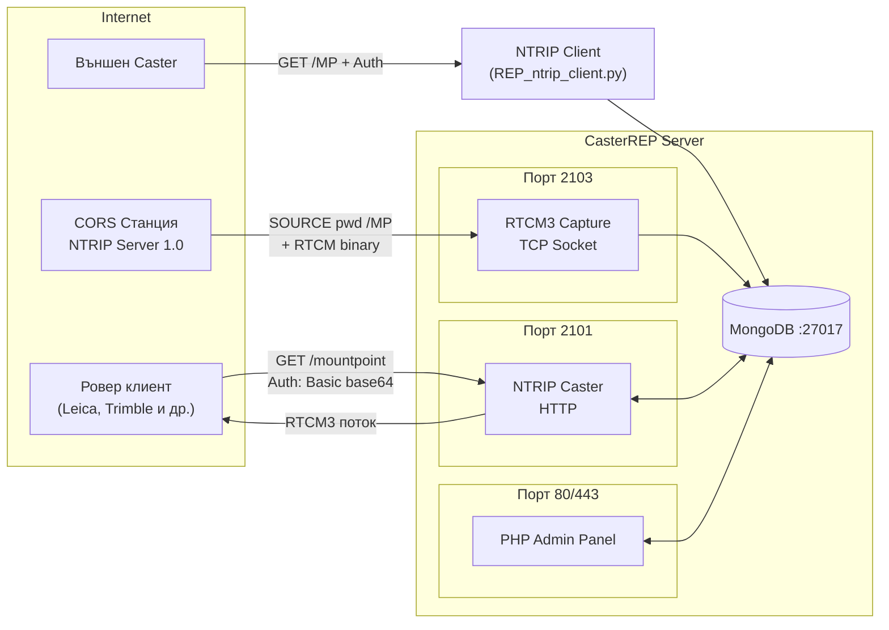

# 📡 Caster REP — Пълен Технически Анализ

> **Caster REP** е NTRIP Caster приложение с отворен код (GPL-3.0), разработено от **Red Extremeña de Posicionamiento** (Университет на Екстремадура, Испания). Системата е предназначена за разпространение на GNSS корекционни данни (RTCM 3.x) в реално време към полеви ровери/потребители чрез NTRIP протокола.

---

## 1. Обща Архитектура



Системата се състои от **3 основни слоя**:

| Слой | Технология | Описание |
|------|-----------|----------|
| **Data Ingestion** | Python TCP/NTRIP | Приемане на сурови RTCM данни от CORS станции |
| **Data Distribution** | Python HTTP (NTRIP Caster) | Разпределяне на данни към крайни потребители |
| **Administration** | PHP + Bootstrap | Уеб панел за управление |
| **Persistence** | MongoDB | Съхранение на всички данни |

---

## 2. Компоненти на Backend (Python)

### 2.1. RTCM3 Capture Server — [REP_rtcm3_capture.py](file:///d:/CasterREP_4.0.220610/CasterREPPy3v4Subido/REP_rtcm3_capture.py)

> **Цел:** Приема сурови RTCM данни от базови GNSS станции, работещи като NTRIP Server 1.0

**Архитектура:**
- Чист TCP сокет сървър (не HTTP), слуша на порт **2103**
- Всяка входяща връзка се обработва в **отделен процес** (`multiprocessing.Process`)
- Daemon процеси — автоматично се убиват при спиране на главния

**Логика на работа:**



**Ключови проверки:**
1. Mountpoint съществува ли в базата?
2. Активен ли е (`active == True`)?
3. Съвпада ли encoder паролата?
4. При приемане на данни — съвпада ли `id_station` между пакета и базата?

---

### 2.2. Caster Server — [REP_caster_server.py](file:///d:/CasterREP_4.0.220610/CasterREPPy3v4Subido/REP_caster_server.py)

> **Цел:** Основният NTRIP Caster — обслужва заявки от ровери (полеви потребители)

**Архитектура:**
- HTTP сървър на базата на `BaseHTTPServer` / `http.server`, порт **2101**
- `ThreadingMixIn` — всяка заявка в отделна нишка
- Съвместим с Python 2 и Python 3 (условна логика)

**Логика на обработка (`handle_data`):**



**Ключови функционалности:**

| Функция | Описание |
|---------|----------|
| `do_SOURCETABLE()` | Генерира NTRIP sourcetable от MongoDB, филтрира неактивни/остарели |
| `checkAuth()` | Валидира Basic Auth token спрямо `users.token_auth` в MongoDB |
| `checkMountpointInDatabase()` | Проверява валидност + активност + свежест на данните |
| `handle_data()` | Главен цикъл — `select()` за I/O мултиплексиране, push на RTCM |
| **NEAREST логика** | Специален mountpoint — ровер изпраща GGA, caster изчислява геодезично разстояние |

**Token автентикация:**
- Паролата се съхранява като `base64(username:password)` в полето `token_auth`
- Сравнение на декодирания username с този в базата

---

### 2.3. NTRIP Client — [REP_ntrip_client.py](file:///d:/CasterREP_4.0.220610/CasterREPPy3v4Subido/REP_ntrip_client.py)

> **Цел:** Свързва се към **външен** NTRIP Caster или директно към станция и записва RTCM данни в MongoDB

**Режими:**
- `--caster` — свързване към отдалечен NTRIP caster с Basic Auth
- `--station` — директна TCP връзка към станция-сървър

**Команден ред:**
```
python REP_ntrip_client.py <ip> <port> -c -m <mountpoint> -u <user> -p <password>
python REP_ntrip_client.py <ip> <port> -s -m <mountpoint>
```

Данните се декодират чрез `decodeRTCM3Packet()` и се записват в `rtcm_raw` с upsert.

---

### 2.4. RTCM3 Decoder — [REP_RTCM3_Decode.py](file:///d:/CasterREP_4.0.220610/CasterREPPy3v4Subido/REP_RTCM3_Decode.py)

> **Цел:** Парсва бинарни RTCM 3.x пакети и извлича метаинформация

**Логика:**
1. Търси RTCM3 преамбюл `0xD3` в хекс представянето
2. Конвертира HEX → BIN и декодира header-а (24 бита)
3. Извлича **номер на съобщението** (12 бита) и **ID на станцията** (12 бита)

**Поддържани RTCM съобщения:**

| Тип | Съобщения | Спътникова система |
|-----|-----------|-------------------|
| Legacy GPS | 1001, 1002, 1003, 1004 | GPS |
| Legacy GLONASS | 1009, 1010, 1011, 1012 | GLONASS |
| MSM GPS | 1071–1077 | GPS |
| MSM GLONASS | 1081–1087 | GLONASS |
| MSM Galileo | 1091–1097 | Galileo |
| MSM BeiDou | 1121–1127 | BeiDou |

**Извлечени данни:** `id_station`, `n_gps`, `n_glo`, `n_gal`, `n_bei`

---

### 2.5. GPGGA Decoder — [REP_GPGGADecoder.py](file:///d:/CasterREP_4.0.220610/CasterREPPy3v4Subido/REP_GPGGADecoder.py)

> **Цел:** Парсва NMEA GGA съобщения от ровери и определя най-близка станция

**Извлечени полета:**
- Географска ширина/дължина (конвертира от NMEA DDmm.mmm → десетични градуси)
- Брой използвани спътници
- Качество на позицията (GPS Fix, DGPS, RTK, Float RTK и т.н.)
- HDOP и латентност

**Функция `getNearestMountpoint()`:**
- Обхожда всички активни non-solution streaming стримове
- Изчислява разстояние с формулата на **Haversine** (сферична тригонометрия)
- Сортира по разстояние и връща най-близкия

---

### 2.6. Rover User Class — [REP_RoverUserClass.py](file:///d:/CasterREP_4.0.220610/CasterREPPy3v4Subido/REP_RoverUserClass.py)

> **Цел:** Модел на свързан ровер потребител

**При създаване (`newUser`):** Записва в `rover_connections`:
- IP, User-Agent, mountpoint, username, login time, connection status

**При прекъсване (`disconnectUser`):** Маркира `conn_status = False`

---

### 2.7. RTCM3 Capture (Windows) — [REP_rtcm3_capture_WIN.py](file:///d:/CasterREP_4.0.220610/CasterREPPy3v4Subido/REP_rtcm3_capture_WIN.py)

- Windows-специфична версия, използва `threading` вместо `multiprocessing`
- `ThreadedTCPServer` с `SocketServer.ThreadingMixIn`
- Идентична бизнес логика на Linux варианта, но по-стара версия (Python 2 синтаксис)

---

### 2.8. Помощни модули

| Модул | Файл | Описание |
|-------|------|----------|
| **Config Loader** | [config_load.py](file:///d:/CasterREP_4.0.220610/CasterREPPy3v4Subido/config_load.py) | Чете `config_var.json` → `config_file.ini` чрез `ConfigObj` |
| **Config File** | [REP_config_file.py](file:///d:/CasterREP_4.0.220610/CasterREPPy3v4Subido/REP_config_file.py) | Hardcoded константи (стар стил, за стари модули) |
| **Config DB** | [config_load_db.py](file:///d:/CasterREP_4.0.220610/CasterREPPy3v4Subido/config_load_db.py) | Алтернативна конфигурация от MongoDB `conf` колекция |
| **General Defs** | [general_defs.py](file:///d:/CasterREP_4.0.220610/CasterREPPy3v4Subido/general_defs.py) | `createMongoClient()` + `format_time()` (динамичен конфиг) |
| **GPS Time** | [gps_time.py](file:///d:/CasterREP_4.0.220610/CasterREPPy3v4Subido/gps_time.py) | Конвертиране GPS седмица/TOW ↔ datetime + leap seconds |
| **Header Printer** | [REP_header_printer.py](file:///d:/CasterREP_4.0.220610/CasterREPPy3v4Subido/REP_header_printer.py) | ASCII арт банер при стартиране |

---

## 3. Конфигурация

### 3.1. INI конфигурация — [config_file.ini](file:///d:/CasterREP_4.0.220610/CasterREPPy3v4Subido/config_file.ini)

```ini
[SETTINGS]
  [[MONGODB]]
    HOST_MONGODB = '127.0.0.1'
    PORT_MONGODB = 27017

  [[PREFERENCES]]
    TIME_OUT_RAWDATA = 30          # Секунди преди данните да се считат за остарели
    STR_NEAREST_MOUNPOINT = 'NEAREST'  # Виртуален mountpoint за NEAREST
    TIME_REFRESH_MSG = 1000        # ms
    TIME_REFRESH_STATUS = 15000    # ms

[PROFILE]
  [[IO]]
    RTCM_CAPTURE_SERVER_HOST = '158.49.61.19'
    RTCM_CAPTURE_SERVER_PORT = 2103   # Порт за приемане от станции
    CASTER_SERVER_HOST = '158.49.61.19'
    CASTER_SERVER_PORT = 2101         # Главен NTRIP порт за клиенти

  [[DATABASE]]
    STR_MONGODB_AUTH_USER = 'c_rep'
    STR_MONGODB_AUTH_PASSWD = '1qazxsw2'
    str_db_Name = 'casterrep'
    # Колекции: users, rtcm_raw, streams, comms, rover_connections
```

### 3.2. Верига на зареждане



---

## 4. MongoDB Схема

### 4.1. База данни: `casterrep`



### 4.2. Роли на колекциите

| Колекция | Роля | Ключово поле |
|----------|------|-------------|
| `streams` | Дефиниция на всички mountpoint-и (sourcetable) | `mountpoint` |
| `users` | Регистрирани потребители с auth tokens | `token_auth` |
| `rtcm_raw` | **1 документ per mountpoint** — актуални бинарни RTCM данни | `mountpoint` + `timestamp` |
| `rover_connections` | Лог на всички ровер сесии + real-time статус | `conn_status` |
| `comms` | Host/port + credentials за всеки mountpoint | - |

> [!IMPORTANT]
> `rtcm_raw` използва **upsert** стратегия — за всеки mountpoint винаги има само **1 документ** с най-новите данни. Това е ефективно за real-time streaming, но не запазва история.

---

## 5. Уеб Административен Панел (PHP)

### 5.1. Технологичен стек

| Компонент | Технология |
|-----------|-----------|
| Backend | PHP 7+ с MongoDB PHP driver (Composer) |
| CSS Framework | Bootstrap 3 |
| Admin Template | SB Admin 2 |
| Таблици | jQuery DataTables |
| Диаграми | Morris.js + Raphael |
| Карта | OpenLayers 3 с Layer Switcher |
| Нотификации | Noty.js |
| Икони | Font Awesome 4 |

### 5.2. Страници и функционалности



### 5.3. Dashboard (index.php)

**KPI панели:**
- Общ брой стриймове
- Регистрирани потребители
- Онлайн стриймове (с цветна индикация: зелено/червено)
- Онлайн потребители

**Таблица Stream Status:**
- Статус (Emitting / Not Emitting / Inactive / Solution)
- Mountpoint, GPS/GLO сателити, последна RTCM актуализация
- **Auto-refresh** на всеки `$dashboard_rate` секунди (default: 15)

**Таблица Online Users:**
- Username, mountpoint, сателити, качество, латентност
- Най-близка станция (с разстояние в km), login час, IP

**Donut диаграма (Morris.js):**
- Визуализация: Emitting vs Not Emitting стриймове

### 5.4. Live Map (map.php)

- **OpenLayers 3** карта с няколко слоя (OSM, satellite)
- **GeoJSON feed** от `generateJSON.php` — опресняване на всеки 30 сек
- Маркери за станции (червено/зелено за offline/online) и ровери
- Popup-и с детайлна информация при кликване

### 5.5. CRUD Операции

**Стриймове:**
| Операция | Файл | Метод |
|----------|------|-------|
| Create | `newStream.php` | POST → MongoDB insertOne |
| Read | `editStreams.php` | MongoDB find → DataTable |
| Update | `editStreamPage.php` | POST → MongoDB updateOne |
| Delete | `deleteStream.php` | GET (AJAX) → MongoDB deleteOne |

**Потребители:**
| Операция | Файл | Метод |
|----------|------|-------|
| Create | `newUser.php` | POST → auto base64 token → insertOne |
| Read | `editUsers.php` | MongoDB find → DataTable |
| Update | `editUserPage.php` | POST → MongoDB updateOne |
| Delete | `deleteUser.php` | GET (AJAX) → MongoDB deleteOne |

### 5.6. Автентикация

- PHP Sessions (`$_SESSION['username']`)
- Login: `base64_encode(username:password)` се сравнява с `token_auth` в MongoDB
- Допълнителна проверка: `type == 0` (само Admin потребители)
- Всяка страница проверява сесия → redirect към `login.php`

---

## 6. Logging система

### 6.1. Конфигурация — [REP_logging_config.json](file:///d:/CasterREP_4.0.220610/CasterREPPy3v4Subido/REP_logging_config.json)

| Logger | Файл | Max размер | Backups |
|--------|------|-----------|---------|
| CasterServer | `caster_server.log` | 10 MB | 20 |
| RTCM3Capture | `rtcm3_capture.log` | 10 MB | 20 |
| CasterReqHandler | `caster_request_handler.log` | 1 MB | 5 |
| Per-Process | `rtcm3_capture_processes.log` | 1 MB | 5 |

Всички използват `RotatingFileHandler` за автоматична ротация.

---

## 7. Мрежова диаграма



---

## 8. Файлова структура — Обобщение

```
CasterREPPy3v4Subido/
├── 🐍 Python Backend
│   ├── REP_caster_server.py      # Главен NTRIP Caster (519 реда)
│   ├── REP_rtcm3_capture.py      # RTCM приемане от станции — Linux (231 реда)
│   ├── REP_rtcm3_capture_WIN.py  # RTCM приемане — Windows (163 реда)
│   ├── REP_ntrip_client.py       # NTRIP клиент за външни кастери (189 реда)
│   ├── REP_RTCM3_Decode.py       # RTCM3 бинарен декодер (89 реда)
│   ├── REP_GPGGADecoder.py       # NMEA GGA парсер + Nearest логика (121 реда)
│   ├── REP_RoverUserClass.py     # Модел за ровер сесия (86 реда)
│   ├── REP_init_mongodb.py       # Начално попълване на БД (84 реда)
│   ├── REP_header_printer.py     # ASCII банер (16 реда)
│   ├── REP_config_file.py        # Хардкодирана конфигурация (15 реда)
│   ├── general_defs.py           # Mongo клиент factory + утилити (23 реда)
│   ├── config_load.py            # INI config loader (25 реда)
│   ├── config_load_db.py         # DB config loader (21 реда)
│   └── gps_time.py               # GPS Time ↔ UTC конвертор (140 реда)
│
├── ⚙️ Конфигурация
│   ├── config_file.ini           # Главна конфигурация
│   ├── config_var.json           # Указател към INI файл
│   ├── configspec                # Валидационна схема за ConfigObj
│   └── REP_logging_config.json   # Logging конфигурация
│
├── 🌐 PHP Web Admin Panel (casterrep/)
│   ├── conf.php                  # MongoDB credentials + dashboard rate
│   ├── login.php                 # Вход
│   ├── logout.php                # Изход
│   ├── index.php                 # Dashboard (509 реда)
│   ├── navigation.php            # Навигационен sidebar
│   ├── footer.php                # Footer
│   ├── newStream.php             # Създаване на стрийм (424 реда)
│   ├── editStreams.php            # Списък стриймове
│   ├── editStreamPage.php        # Редакция на стрийм
│   ├── deleteStream.php          # Изтриване стрийм (AJAX)
│   ├── newUser.php               # Създаване потребител (295 реда)
│   ├── editUsers.php             # Списък потребители
│   ├── editUserPage.php          # Редакция потребител
│   ├── deleteUser.php            # Изтриване потребител (AJAX)
│   ├── map.php                   # Жива карта (OpenLayers)
│   ├── generateJSON.php          # GeoJSON API за картата
│   ├── iso3166-1-a3.php          # ISO кодове на държави
│   ├── js/                       # JavaScript: map.js, editstreams.js, editusers.js, ol.js
│   ├── css/                      # CSS: sb-admin-2.css, signin.css, map.css, ol.css
│   ├── img/                      # Лога и изображения
│   └── vendor/                   # Composer (MongoDB, Bootstrap, jQuery, Morris, DataTables)
│
└── 📋 Логове
    ├── caster_server.log
    ├── caster_request_handler.log (x6)
    └── rtcm3_capture_processes.log (x6)
```

---

## 9. Забележки и наблюдения

> [!WARNING]
> ### Проблеми със сигурността
> - `config_file.ini` и `REP_config_file.py` съдържат **hardcoded MongoDB credentials** в plain text
> - `conf.php` съдържа placeholder credentials (`username`/`password`)
> - `deleteStream.php` и `deleteUser.php` използват **GET параметри** за ID — уязвими за CSRF
> - Паролите на потребителите се съхраняват като **Base64** (не криптирани, не хеширани)
> - `encoder_pwd` за станциите се съхранява в plain text

> [!NOTE]
> ### Архитектурни бележки
> - Двойна система за конфигурация — стар стил (`REP_config_file.py` хардкод) и нов (`config_load.py` + INI)
> - `REP_rtcm3_capture_WIN.py` е остаряла Python 2 версия, докато останалите модули са мигрирани към Python 3
> - `rtcm_raw` съхранява **1 документ** per mountpoint (upsert) — няма исторически данни
> - `select()` цикълът в caster server-а е блокиращ per-thread — ефективно за ниска натовареност

> [!TIP]
> ### Силни страни
> - Пълна NTRIP 1.0 съвместимост
> - Мулти-GNSS поддръжка (GPS, GLONASS, Galileo, BeiDou)
> - NEAREST функциалност — автоматичен избор на най-близка станция
> - Comprehensive уеб панел с live monitoring и карта
> - Добра logging инфраструктура с ротация
